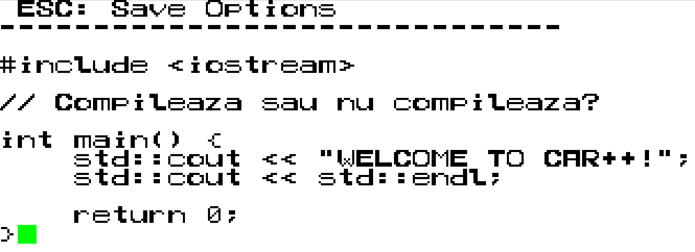
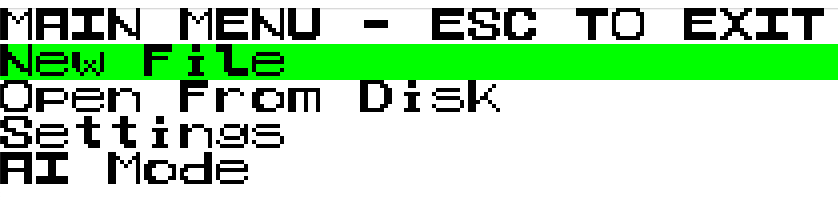
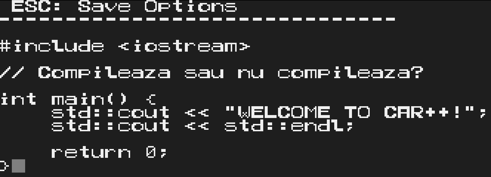
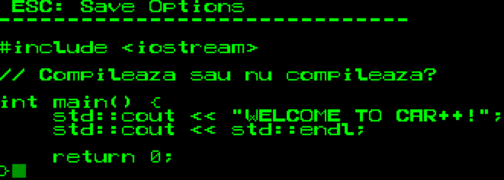
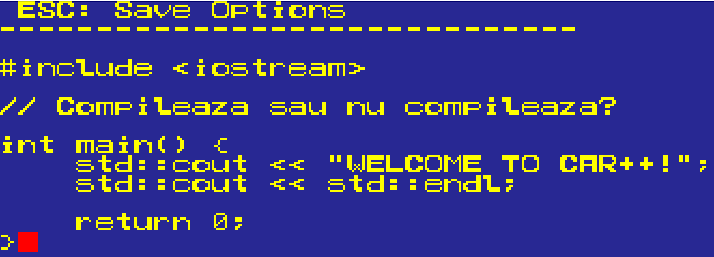
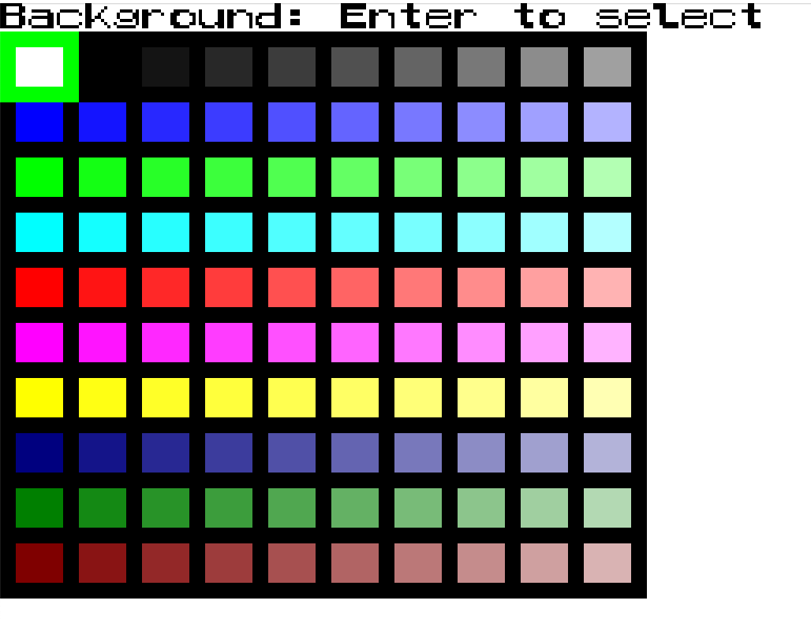
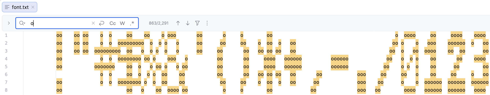

# car_plus_plus
car_plus_plus is a very low-level text editor. "car" stands for the Romanian "caracter" (English: character).

## Demo
  

## Features

You can use almost all the common controls shared by most text editors.
- Windows/Linux:
  - shift+arrows = custom selection
  - Ctrl+X = cut
  - Ctrl+C = copy
  - Ctrl+V = paste
  - Ctrl+A = select all
  - Ctrl + Left / Right: Moves the text cursor word-by-word without highlighting anything.
  - Ctrl + Shift + Left / Right: Expands or shrinks the text selection word-by-word.
- Mac:
    - shift+arrows = custom selection
    - Command+X = cut
    - Command+C = copy
    - Command+V = paste
    - Command+A = select all
    - Alt + Left / Right: Moves the text cursor word-by-word without highlighting anything.
    - Alt + Shift + Left / Right: Expands or shrinks the text selection word-by-word. 

To navigate through the menu, use arrows+enter.
Important: when you set the colors, the program ensures that background != text != cursor, so if they are not updated, it is not a bug.

## Gallery
  
  
  
  
  

## Menu hierarchy
 - main menu
   - new file
   - open from disk
   - settings
     - choose theme
       - light theme
       - dark theme
       - matrix theme
       - modern theme
     - custom colors
       - background color
       - text color
       - cursor color
     - pixel size
       - increase
       - decrease
     - change language (toggles between English and Romanian)
     - restore defaults
   - AI Mode

## Limitations

- Don't use ctrl+Z (undo), because it is not yet implemented (and probably it will never be).
- The editor only supports ascii chars. Typing a non-ascii char will add a default 'unknown char'.

## The font

- The font is hard-codded and hand-made
- Each char is an 8*8 matrix coded like this (a question mark as example):
```text
0b01111110 == 126          oooooo
0b11000011 == 195         oo    oo
0b10000011 == 131         o     oo
0b00011110 ==  30            oooo
0b00011000 ==  24            oo
0b00000000 ==   0         
0b00011000 ==  24            oo   
0b00011000 ==  24            oo
```
- These numbers are stored in the font.txt file
- Here is an excerpt from the original font.txt file
  
## Configuration & Asset Management

The application loads its settings, menu localizations, and structural assets dynamically at runtime using relative paths based on the application's execution directory.

### Prerequisites for Running Standalone
When building the project via CMake, a custom post-build step automatically copies the `config` and `assets` directories directly to the build output folder (where the executable binary resides).

If you copy or move the built executable (`./oop`), you **must** ensure that the `config/` and `assets/` folders are kept in the exact same directory as the executable.

```text
.
├── oop (executable)
├── config/
│   ├── settings.txt
│   ├── menu_eng.txt
│   └── menu_ro.txt
└── assets/
    ├── font.txt
    └── tilePanelData.txt
```

## License

The project is licensed under [AGPLv3](LICENSE).

The [template repository](https://github.com/mcmarius/oop-template) itself is licensed under [Unlicense](LICENSE.template).

## Resources
<!-- renovate: datasource=github-tags depName=SFML/SFML versioning=loose -->
- [SFML](https://github.com/SFML/SFML/tree/3.0.2) (Zlib)
- [portable-file-dialogs](https://github.com/samhocevar/portable-file-dialogs) (WTFPL)

## Linux Dependencies

The file picker dialogs (`Open From Disk`) rely on a native desktop backend to generate graphical dialog overlays. If you are compiling or running the application on Linux (especially within a clean WSL setup or a minimalist window manager like i3, dwm, etc.), ensure you have at least one of the following system utilities installed:

- `zenity` (Standard for GNOME/GTK-based desktops)
- `kdialog` (Standard for KDE-based desktops)
- `matedialog` or `qarma`

On Ubuntu/Debian, you can install the most common backend by running:
```bash
sudo apt update && sudo apt install zenity
```
